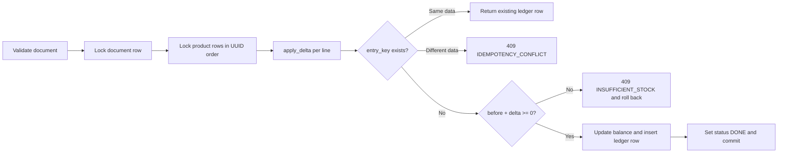

# StockSense Database Design

This document describes the PostgreSQL schema that StockSense currently uses. The source of truth is [`backend/app/models.py`](../backend/app/models.py) and the Alembic migrations in [`backend/migrations/versions`](../backend/migrations/versions). If this page and the code disagree, the code is correct.

## Contents

- [Overview](#overview)
- [Entity relationship diagram](#entity-relationship-diagram)
- [Conventions](#conventions)
- [Tables](#tables)
- [Stock integrity guarantees](#stock-integrity-guarantees)
- [Delete behaviour](#delete-behaviour)
- [Migrations](#migrations)
- [Useful queries](#useful-queries)

## Overview

The schema has 17 tables in five groups:

| Group | Tables | Purpose |
| --- | --- | --- |
| Identity and access | `roles`, `users`, `password_resets` | Accounts, roles, lockout state, token revocation, OTP recovery |
| Catalog | `categories`, `products`, `reorder_rules` | Product identity, units, opening stock, low-stock thresholds |
| Warehouse layout | `warehouses`, `locations` | Warehouses and the storage locations inside them |
| Stock state | `stock_balances`, `stock_ledger` | Current on-hand quantity per location, plus an append-only movement history |
| Operations | `receipts`, `receipt_items`, `deliveries`, `delivery_items`, `transfers`, `transfer_items`, `adjustments` | Documents that change stock only when they are validated |

The design has one core rule: **stock is tracked per product per location, and every change is written to the ledger in the same transaction that changes the balance.**

## Entity relationship diagram

```mermaid
erDiagram
    ROLES ||--o{ USERS : "grants"
    USERS ||--o| PASSWORD_RESETS : "has active challenge"
    CATEGORIES ||--o{ PRODUCTS : "classifies"
    PRODUCTS ||--o| REORDER_RULES : "has threshold"
    WAREHOUSES ||--o{ LOCATIONS : "contains"
    PRODUCTS ||--o{ STOCK_BALANCES : "stocked as"
    LOCATIONS ||--o{ STOCK_BALANCES : "holds"
    PRODUCTS ||--o{ STOCK_LEDGER : "moved in"
    LOCATIONS ||--o{ STOCK_LEDGER : "affected"
    USERS ||--o{ STOCK_LEDGER : "performed"
    USERS ||--o{ RECEIPTS : "created"
    USERS ||--o{ DELIVERIES : "created"
    USERS ||--o{ TRANSFERS : "created"
    USERS ||--o{ ADJUSTMENTS : "created"
    RECEIPTS ||--|{ RECEIPT_ITEMS : "lines"
    DELIVERIES ||--|{ DELIVERY_ITEMS : "lines"
    TRANSFERS ||--|{ TRANSFER_ITEMS : "lines"
    PRODUCTS ||--o{ RECEIPT_ITEMS : "received"
    LOCATIONS ||--o{ RECEIPT_ITEMS : "put away at"
    PRODUCTS ||--o{ DELIVERY_ITEMS : "shipped"
    LOCATIONS ||--o{ DELIVERY_ITEMS : "picked from"
    PRODUCTS ||--o{ TRANSFER_ITEMS : "moved"
    LOCATIONS ||--o{ TRANSFER_ITEMS : "source or destination"
    PRODUCTS ||--o{ ADJUSTMENTS : "counted"
    LOCATIONS ||--o{ ADJUSTMENTS : "counted at"

    ROLES {
        varchar32 name PK "INVENTORY_MANAGER or WAREHOUSE_STAFF"
    }
    USERS {
        uuid id PK
        varchar64 login_id UK
        varchar254 email UK
        varchar120 name
        varchar255 password_hash "Argon2"
        varchar32 role FK
        int token_version "bumped on logout or reset"
        int failed_logins
        bigint locked_until "unix seconds"
        timestamptz created_at
        timestamptz updated_at
    }
    PASSWORD_RESETS {
        uuid user_id PK, FK
        varchar64 otp_hash "HMAC-SHA256"
        bigint issued_at
        bigint expires_at
        int attempts
        varchar64 reset_token_hash UK "nullable"
    }
    CATEGORIES {
        uuid id PK
        varchar120 name UK
    }
    WAREHOUSES {
        uuid id PK
        varchar120 name
        varchar32 short_code UK
        varchar500 address
    }
    LOCATIONS {
        uuid id PK
        uuid warehouse_id FK
        varchar120 name
        varchar32 short_code "unique per warehouse"
    }
    PRODUCTS {
        uuid id PK
        varchar160 name
        varchar64 sku UK
        uuid category_id FK
        varchar32 unit_of_measure
        numeric initial_stock "opening metadata"
    }
    REORDER_RULES {
        uuid id PK
        uuid product_id FK, UK
        numeric minimum_stock
        numeric reorder_quantity
    }
    STOCK_BALANCES {
        uuid product_id PK, FK
        uuid location_id PK, FK
        numeric quantity "never negative"
    }
    STOCK_LEDGER {
        uuid id PK
        uuid product_id FK
        uuid location_id FK
        varchar transaction_type
        varchar120 reference_id
        varchar180 entry_key UK "idempotency key"
        numeric quantity "signed delta"
        numeric before_quantity
        numeric after_quantity
        uuid from_location_id FK "nullable"
        uuid to_location_id FK "nullable"
        uuid user_id FK
        timestamptz created_at
    }
    RECEIPTS {
        uuid id PK
        varchar200 supplier
        varchar notes
        varchar status
        uuid created_by FK
    }
    RECEIPT_ITEMS {
        uuid id PK
        uuid receipt_id FK
        uuid product_id FK
        uuid location_id FK "destination"
        numeric quantity
    }
    DELIVERIES {
        uuid id PK
        varchar notes
        varchar status
        uuid created_by FK
    }
    DELIVERY_ITEMS {
        uuid id PK
        uuid delivery_id FK
        uuid product_id FK
        uuid location_id FK "source"
        numeric quantity
    }
    TRANSFERS {
        uuid id PK
        varchar notes
        varchar status
        uuid created_by FK
    }
    TRANSFER_ITEMS {
        uuid id PK
        uuid transfer_id FK
        uuid product_id FK
        uuid source_location_id FK
        uuid destination_location_id FK
        numeric quantity
    }
    ADJUSTMENTS {
        uuid id PK
        uuid product_id FK
        uuid location_id FK
        numeric counted_quantity
        numeric recorded_quantity "set on validate"
        numeric delta "set on validate"
        varchar500 reason
        varchar status
        uuid created_by FK
    }
```



Most tables also have `created_at` and `updated_at` columns. The diagram leaves them out of the smaller tables to keep it readable.

## Conventions

| Convention | Detail |
| --- | --- |
| Primary keys | UUID v4 generated by the application (`Identity` mixin). Exceptions: `roles.name`, `password_resets.user_id`, and the composite key on `stock_balances`. |
| Timestamps | `created_at` and `updated_at` are `TIMESTAMPTZ` with a `now()` server default; `updated_at` is refreshed on update (`Timestamps` mixin). `stock_ledger` has only `created_at` because its rows never change. |
| Quantities | `NUMERIC(18,4)`, mapped to Python `Decimal`. The API sends them as JSON strings so no precision is lost. |
| Statuses | `DRAFT`, `WAITING`, `READY`, `DONE`, `CANCELED`, enforced by a `CHECK` constraint on each operation table. |
| Movement types | `INITIAL`, `RECEIPT`, `DELIVERY`, `TRANSFER`, `ADJUSTMENT`, enforced by a `CHECK` constraint on `stock_ledger`. |
| Foreign keys | Default to `ON DELETE RESTRICT`. Only operation lines (to their header) and `password_resets` (to their user) cascade. |
| Index names | `ix_<table>_<column>`, created for foreign keys used in filters. |
| Security timestamps | `locked_until`, `issued_at` and `expires_at` store Unix epoch seconds as `BIGINT`. |

## Tables

### Identity and access

#### `roles`

| Column | Type | Constraints |
| --- | --- | --- |
| `name` | `VARCHAR(32)` | PK; `CHECK name IN ('INVENTORY_MANAGER','WAREHOUSE_STAFF')` |

Both rows are seeded by migration `0001`. Public signup always assigns `WAREHOUSE_STAFF`. Promotion to manager happens only through the local CLI `python -m app.admin promote EMAIL`.

#### `users`

| Column | Type | Constraints / notes |
| --- | --- | --- |
| `id` | `UUID` | PK |
| `login_id` | `VARCHAR(64)` | Unique; stored lowercase; the API allows 6–64 chars from `[a-zA-Z0-9_.-]` |
| `email` | `VARCHAR(254)` | Unique; stored lowercase |
| `name` | `VARCHAR(120)` | |
| `password_hash` | `VARCHAR(255)` | Argon2 hash (via `pwdlib`) |
| `role` | `VARCHAR(32)` | FK → `roles.name`, `RESTRICT` |
| `token_version` | `INTEGER` | Default 0; tokens carrying an older version are rejected |
| `failed_logins` | `INTEGER` | Default 0; reaching 5 locks the account |
| `locked_until` | `BIGINT` | Default 0; lock lasts 900 s (15 min) |
| `created_at`, `updated_at` | `TIMESTAMPTZ` | |

#### `password_resets`

This table holds at most one active recovery challenge per user.

| Column | Type | Constraints / notes |
| --- | --- | --- |
| `user_id` | `UUID` | PK, FK → `users.id`, `CASCADE` |
| `otp_hash` | `VARCHAR(64)` | HMAC-SHA256 of `user_id:otp`, keyed with `JWT_SECRET`; the plain OTP is never stored |
| `issued_at` | `BIGINT` | Used to allow at most one resend per 60 s |
| `expires_at` | `BIGINT` | OTP is valid for 600 s; after verification, the reset token is valid for another 600 s |
| `attempts` | `INTEGER` | Maximum 5 verification attempts |
| `reset_token_hash` | `VARCHAR(64)` | Unique, nullable; set after a successful OTP check, and the row is deleted when the token is used |

### Catalog

#### `categories`

| Column | Type | Constraints |
| --- | --- | --- |
| `id` | `UUID` | PK |
| `name` | `VARCHAR(120)` | Unique |

A category can be deleted only while no product references it; otherwise the API returns `409 DATA_CONFLICT`.

#### `products`

| Column | Type | Constraints / notes |
| --- | --- | --- |
| `id` | `UUID` | PK |
| `name` | `VARCHAR(160)` | |
| `sku` | `VARCHAR(64)` | Unique; pattern `[A-Za-z0-9_.-]+` |
| `category_id` | `UUID` | FK → `categories.id`, `RESTRICT`, indexed |
| `unit_of_measure` | `VARCHAR(32)` | Cannot change once the product has ledger entries (`409 UNIT_IN_USE`) |
| `initial_stock` | `NUMERIC(18,4)` | `CHECK >= 0`. This is historical opening metadata; the live quantity is in `stock_balances`. |

If `initial_stock > 0`, creating the product also posts an `INITIAL` ledger entry at `initial_location_id` in the same transaction.

#### `reorder_rules`

| Column | Type | Constraints |
| --- | --- | --- |
| `id` | `UUID` | PK |
| `product_id` | `UUID` | FK → `products.id`, **unique**, so each product has at most one rule |
| `minimum_stock` | `NUMERIC(18,4)` | `CHECK >= 0` |
| `reorder_quantity` | `NUMERIC(18,4)` | `CHECK > 0` |

A product is **low stock** when its total quantity across all locations is `<= minimum_stock`.

### Warehouse layout

#### `warehouses`

| Column | Type | Constraints |
| --- | --- | --- |
| `id` | `UUID` | PK |
| `name` | `VARCHAR(120)` | |
| `short_code` | `VARCHAR(32)` | Unique; pattern `[A-Za-z0-9_-]+` |
| `address` | `VARCHAR(500)` | Default empty |

#### `locations`

| Column | Type | Constraints / notes |
| --- | --- | --- |
| `id` | `UUID` | PK |
| `warehouse_id` | `UUID` | FK → `warehouses.id`, `RESTRICT`, indexed |
| `name` | `VARCHAR(120)` | |
| `short_code` | `VARCHAR(32)` | `UNIQUE (warehouse_id, short_code)` as `uq_location_code` |

A location cannot move to another warehouse after it has been used (`409 LOCATION_WAREHOUSE_FIXED`).

### Stock state

#### `stock_balances`

This table holds the current on-hand quantity of one product at one location.

| Column | Type | Constraints |
| --- | --- | --- |
| `product_id` | `UUID` | PK part 1, FK → `products.id`, `RESTRICT` |
| `location_id` | `UUID` | PK part 2, FK → `locations.id`, `RESTRICT`, indexed |
| `quantity` | `NUMERIC(18,4)` | `CHECK quantity >= 0` (`nonnegative_stock`) |
| `created_at`, `updated_at` | `TIMESTAMPTZ` | |

A row is created the first time stock arrives at a location. Warehouse and product totals are computed with `SUM(quantity)` grouped as needed.

#### `stock_ledger`

This table is the append-only movement history. Each row describes a single change to a single balance.

| Column | Type | Constraints / notes |
| --- | --- | --- |
| `id` | `UUID` | PK |
| `product_id` | `UUID` | FK, indexed |
| `location_id` | `UUID` | FK, indexed; the balance that changed |
| `transaction_type` | `VARCHAR` | `CHECK IN ('INITIAL','RECEIPT','DELIVERY','TRANSFER','ADJUSTMENT')` |
| `reference_id` | `VARCHAR(120)` | Indexed; the UUID of the source document (or product, for `INITIAL`) |
| `entry_key` | `VARCHAR(180)` | **Unique** idempotency key, for example `receipt:{id}:{line}` or `transfer:{id}:{line}:src` |
| `quantity` | `NUMERIC(18,4)` | Signed delta, `CHECK quantity <> 0` |
| `before_quantity` | `NUMERIC(18,4)` | `CHECK >= 0` |
| `after_quantity` | `NUMERIC(18,4)` | `CHECK >= 0` and `CHECK after_quantity = before_quantity + quantity` |
| `from_location_id` | `UUID` | Nullable FK; source for deliveries and transfers |
| `to_location_id` | `UUID` | Nullable FK; destination for receipts, transfers and opening stock |
| `user_id` | `UUID` | FK → `users.id`; who validated the movement |
| `created_at` | `TIMESTAMPTZ` | |

A transfer line writes **two** rows: `-q` at the source (`:src` key) and `+q` at the destination (`:dst` key). Both rows share the same `reference_id` and have both `from_location_id` and `to_location_id` filled in.

### Operations

The three document headers share the same shape and state machine:

| Table | Specific columns | Line table | Line location columns |
| --- | --- | --- | --- |
| `receipts` | `supplier VARCHAR(200)`, `notes VARCHAR(1000)` | `receipt_items` | `location_id` (put-away destination) |
| `deliveries` | `notes VARCHAR(1000)` | `delivery_items` | `location_id` (pick source) |
| `transfers` | `notes VARCHAR(1000)` | `transfer_items` | `source_location_id`, `destination_location_id` |

Every header has `id`, `status` (`CHECK` in the five statuses), `created_by` (FK → `users.id`), `created_at` and `updated_at`. Every line has `id`, a header FK with `ON DELETE CASCADE` (indexed), `product_id` (indexed), and `quantity NUMERIC(18,4) CHECK > 0`.

#### `adjustments`

An adjustment is a single-line document, so it has no child table.

| Column | Type | Constraints / notes |
| --- | --- | --- |
| `id` | `UUID` | PK |
| `product_id` | `UUID` | FK, indexed |
| `location_id` | `UUID` | FK |
| `counted_quantity` | `NUMERIC(18,4)` | `CHECK >= 0`; the physical count |
| `recorded_quantity` | `NUMERIC(18,4)` | Nullable; the system quantity captured at validation |
| `delta` | `NUMERIC(18,4)` | Nullable; `counted - recorded`, captured at validation |
| `reason` | `VARCHAR(500)` | Required and must not be blank (`422 REASON_REQUIRED`) |
| `status` | `VARCHAR` | `DRAFT → DONE` or `DRAFT → CANCELED` |
| `created_by` | `UUID` | FK → `users.id` |

## Stock integrity guarantees

Several layers work together so that balances and history cannot drift apart:

| Guarantee | Enforced by |
| --- | --- |
| No negative stock | `stock_balances.quantity >= 0` check, plus an `INSUFFICIENT_STOCK` check in `apply_delta` before writing |
| Ledger arithmetic always adds up | `CHECK after_quantity = before_quantity + quantity` |
| No zero-quantity movements | `CHECK quantity <> 0` on the ledger |
| History cannot be edited | Triggers `stock_ledger_immutable` (`BEFORE UPDATE OR DELETE`) and `stock_ledger_no_truncate` (`BEFORE TRUNCATE`) call `reject_ledger_mutation()`, which raises `Stock ledger is append-only` |
| Retries do not double-post | Unique `entry_key`. Replaying the same key with the same data returns the existing row; a different payload returns `409 IDEMPOTENCY_CONFLICT`. |
| Balance and ledger change together | `apply_delta` updates the balance and inserts the ledger row in the caller's transaction and never commits by itself |
| No lost updates under concurrency | `SELECT … FOR UPDATE` on the document and product rows; multi-product documents lock products in ascending UUID order to avoid deadlocks |



## Delete behaviour

| Parent | Child | Rule | Effect |
| --- | --- | --- | --- |
| `users` | `password_resets` | `CASCADE` | Deleting a user removes their reset challenge |
| `receipts` / `deliveries` / `transfers` | their `*_items` | `CASCADE` | Lines belong to their document |
| `categories`, `warehouses`, `locations`, `products`, `users`, `roles` | everything else | `RESTRICT` | Referenced master data cannot be deleted; the API maps this to `409 DATA_CONFLICT` |

The API exposes delete only for unreferenced categories and for lines on documents that are not yet in a terminal state. Products, warehouses and locations cannot be deleted through the API, so their history stays intact.

## Migrations

| Revision | File | Contents |
| --- | --- | --- |
| `0001` | [`0001_member1_core_schema.py`](../backend/migrations/versions/0001_member1_core_schema.py) | Roles (seeded), users, password resets, categories, warehouses, locations, products, reorder rules, stock balances, stock ledger, ledger immutability function and triggers |
| `0002` | [`0002_member2_operations_schema.py`](../backend/migrations/versions/0002_member2_operations_schema.py) | Receipts, deliveries, transfers, their item tables, and adjustments |

```bash
cd backend
alembic upgrade head      # apply
alembic downgrade base    # remove everything (development only)
```

The test suite includes a migration round trip (`test_migration_round_trip`) that checks both directions.

## Useful queries

Current stock per product and warehouse:

```sql
SELECT p.sku, w.short_code AS warehouse, SUM(b.quantity) AS on_hand
FROM stock_balances b
JOIN products p   ON p.id = b.product_id
JOIN locations l  ON l.id = b.location_id
JOIN warehouses w ON w.id = l.warehouse_id
GROUP BY p.sku, w.short_code
ORDER BY p.sku, w.short_code;
```

Products at or below their reorder minimum:

```sql
SELECT p.sku, r.minimum_stock, COALESCE(SUM(b.quantity), 0) AS total
FROM products p
JOIN reorder_rules r ON r.product_id = p.id
LEFT JOIN stock_balances b ON b.product_id = p.id
GROUP BY p.sku, r.minimum_stock
HAVING COALESCE(SUM(b.quantity), 0) <= r.minimum_stock;
```

Check that the ledger reproduces every balance (this should return no rows):

```sql
SELECT b.product_id, b.location_id, b.quantity, SUM(l.quantity) AS ledger_sum
FROM stock_balances b
JOIN stock_ledger l ON l.product_id = b.product_id AND l.location_id = b.location_id
GROUP BY b.product_id, b.location_id, b.quantity
HAVING SUM(l.quantity) <> b.quantity;
```
