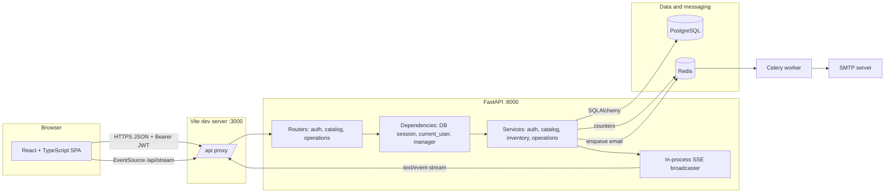
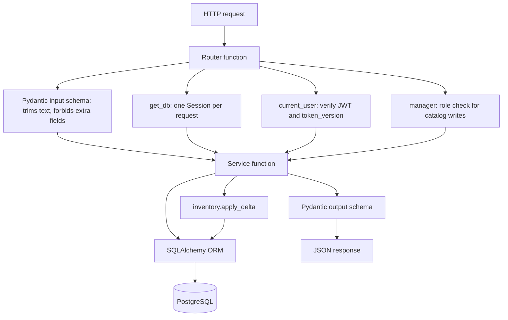
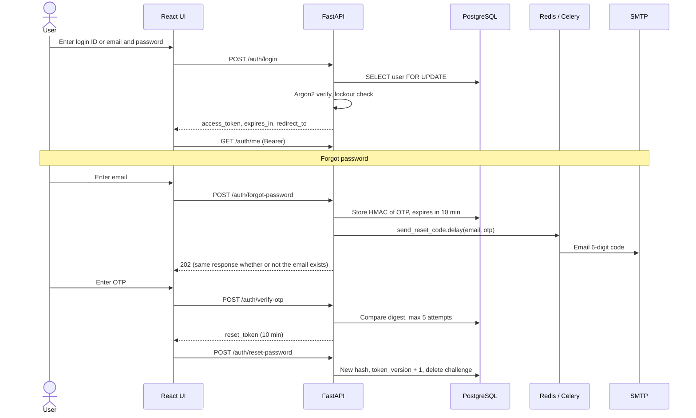
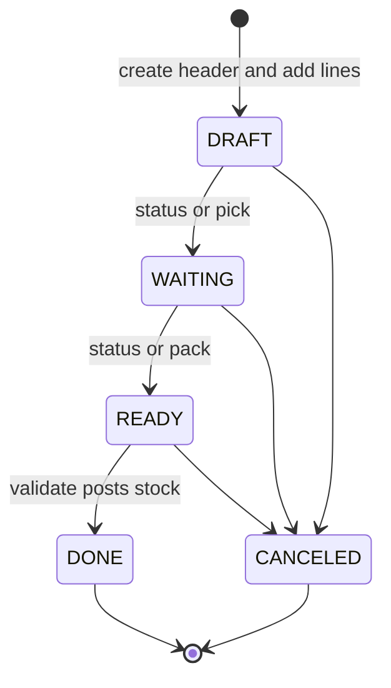
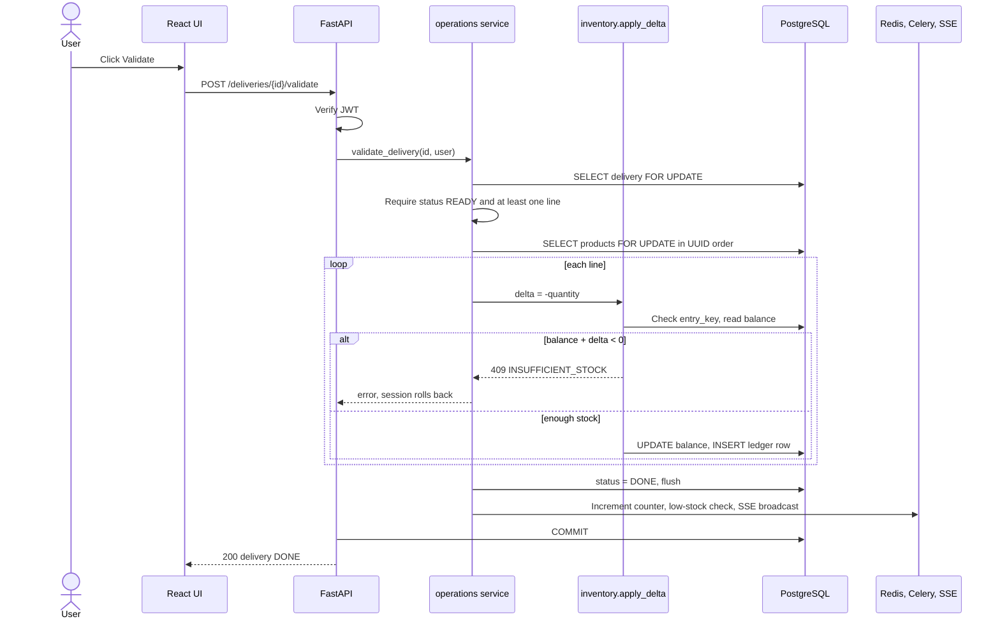
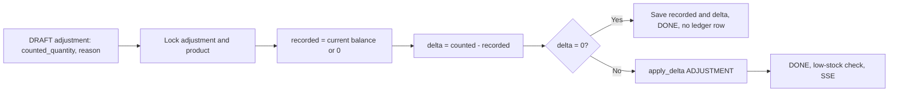
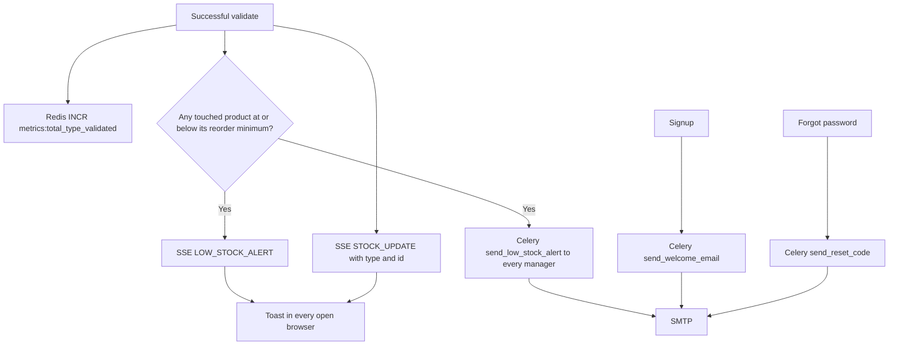
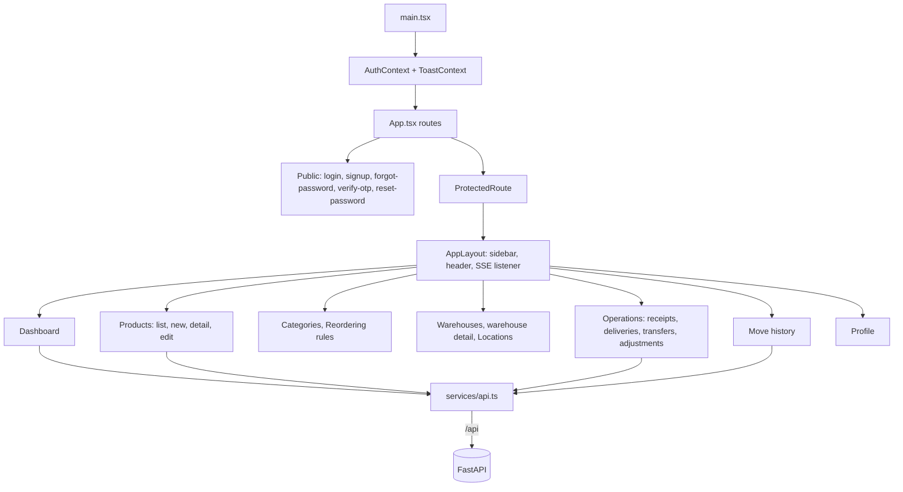
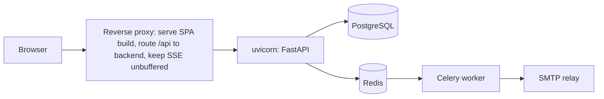

# StockSense System Design

This document describes how StockSense is built: its components, the request and data flows, and how stock changes stay consistent. It covers the code in this repository. For design choices and their trade-offs, see [TECHNICAL_DECISIONS.md](TECHNICAL_DECISIONS.md). For the schema, see [DATABASE.md](DATABASE.md). For endpoints, see [API.md](API.md).

## Contents

- [Goals and constraints](#goals-and-constraints)
- [High-level architecture](#high-level-architecture)
- [Components](#components)
- [Backend layering](#backend-layering)
- [Authentication and authorization](#authentication-and-authorization)
- [Operation lifecycle](#operation-lifecycle)
- [Stock movement flows](#stock-movement-flows)
- [Transactions, locking and idempotency](#transactions-locking-and-idempotency)
- [Events, notifications and background jobs](#events-notifications-and-background-jobs)
- [Frontend architecture](#frontend-architecture)
- [Error model](#error-model)
- [Configuration](#configuration)
- [Deployment view](#deployment-view)
- [Known limitations](#known-limitations)

## Goals and constraints

| Goal | How the design meets it |
| --- | --- |
| Stock numbers must always be correct | Every change goes through one function (`apply_delta`) that updates the balance and writes a ledger row in the same database transaction |
| Full audit trail | `stock_ledger` is append-only and protected by database triggers |
| Multi-warehouse | Stock is tracked per `(product, location)`, and locations belong to warehouses |
| Safe under concurrent users | Row locks in a fixed order, a non-negative `CHECK`, and idempotent entry keys |
| Simple for warehouse staff | Documents move through a clear state machine: Draft → Waiting → Ready → Done |
| Built in a hackathon timebox | A monolithic FastAPI service, one PostgreSQL database, and a single-page React app |

## High-level architecture



## Components

| Component | Technology | Responsibility | Key files |
| --- | --- | --- | --- |
| Web client | React 19, TypeScript, React Router 7, Vite 8, Lucide icons | Screens for auth, dashboard, products, operations, move history and settings | `frontend/src/App.tsx`, `frontend/src/pages/**` |
| API client | `fetch` wrapper | Adds the Bearer token, parses JSON, maps errors | `frontend/src/services/api.ts` |
| HTTP API | FastAPI, Pydantic v2 | Validation, routing, auth dependencies, error mapping | `backend/app/main.py`, `routes.py`, `op_routes.py` |
| Domain services | Python | Business rules, state machine, stock posting | `backend/app/services/*.py` |
| Persistence | SQLAlchemy 2, Alembic, psycopg 3 | ORM models, migrations | `backend/app/models.py`, `backend/migrations/` |
| Database | PostgreSQL 15+ | Source of truth, constraints, triggers, row locks | — |
| Cache / broker | Redis 7 | Celery broker and result backend; validation counters | `redis_client.py`, `celery_app.py` |
| Worker | Celery 5 | Sends welcome, OTP and low-stock emails | `tasks.py`, `services/mailer.py` |
| Live events | Server-Sent Events | Pushes `STOCK_UPDATE` and `LOW_STOCK_ALERT` to open browsers | `services/sse.py`, `layouts/AppLayout.tsx` |
| Operator CLI | argparse | Promotes a user to inventory manager | `backend/app/admin.py` |
| Demo data | Python script | Loads the TechParts sample company | `backend/seed.py` |

## Backend layering



- **Routers** are thin: they wire dependencies, call one service function and declare the response model.
- **Services** own all rules. They raise `DomainError(status, code, message)` and never commit.
- **`get_db`** opens a session, commits when the handler returns normally, and rolls back on any exception. One request is one transaction.
- **`apply_delta`** is the only code path that writes `stock_balances` or `stock_ledger`.

## Authentication and authorization

### Token model

| Property | Value |
| --- | --- |
| Algorithm | HS256 with `JWT_SECRET` (at least 32 chars; placeholders are rejected at startup) |
| Claims | `sub` (user id), `ver` (token version), `iat`, `exp`, `iss=stocksense`, `aud=stocksense-api`, `jti`, `type=access` |
| Lifetime | `ACCESS_TOKEN_MINUTES`, default 30 |
| Revocation | Logout and password reset increment `users.token_version`, which invalidates every earlier token |
| Password hashing | Argon2 via `pwdlib` recommended settings |
| Brute-force protection | 5 failed logins lock the account for 15 minutes (`429 LOGIN_THROTTLED`). Unknown users are checked against a dummy hash so response timing matches. |
| Caching | `/auth/*` responses carry `Cache-Control: no-store` |

### Login and password reset



### Roles

| Capability | `INVENTORY_MANAGER` | `WAREHOUSE_STAFF` |
| --- | --- | --- |
| Read products, stock, ledger, dashboard | ✅ | ✅ |
| Create or edit products, categories, warehouses, locations, reorder rules | ✅ | ❌ `403 FORBIDDEN` |
| Create and process receipts, deliveries, transfers, adjustments | ✅ | ✅ |

Signup always creates `WAREHOUSE_STAFF`. The first manager is created with `python -m app.admin promote EMAIL`, which also bumps `token_version` so the user signs in again with the new role.

## Operation lifecycle

Receipts, deliveries and transfers share one state machine (`_VALID_TRANSITIONS` in `services/operations.py`):



- Lines can be added or removed only while the document is not `DONE` or `CANCELED`.
- `validate` requires `READY` and at least one line (`409 EMPTY_OPERATION`).
- Deliveries use named actions: `pick` (DRAFT → WAITING), `pack` (WAITING → READY) and `cancel`.
- Adjustments are simpler: `DRAFT → DONE` on validate, or `DRAFT → CANCELED`.

## Stock movement flows

| Operation | Ledger rows per line | Balance effect | Entry key |
| --- | --- | --- | --- |
| Opening stock (product create) | 1 × `INITIAL` | `+initial_stock` at the chosen location | `initial:{product}` |
| Receipt | 1 × `RECEIPT` | `+q` at the line location | `receipt:{doc}:{line}` |
| Delivery | 1 × `DELIVERY` | `−q` at the line location; fails if short | `delivery:{doc}:{line}` |
| Transfer | 2 × `TRANSFER` | `−q` at source, `+q` at destination; total unchanged | `transfer:{doc}:{line}:src` / `:dst` |
| Adjustment | 0 or 1 × `ADJUSTMENT` | `counted − recorded` at the location | `adjustment:{doc}` |

### Validation sequence (all document types)



### Adjustment calculation



## Transactions, locking and idempotency

1. **One request is one transaction.** `get_db` commits after the handler returns and rolls back on any exception, so a delivery with five lines either posts all five or none.
2. **Document lock.** `validate_*` reads the document with `FOR UPDATE`. Two users clicking Validate at the same time are serialized, and the second one sees `DONE` and gets `409`.
3. **Product locks in a fixed order.** Product rows are locked in ascending UUID order before any balance changes. Because every transaction acquires locks in the same order, two documents that touch the same products cannot deadlock.
4. **Database-level safety net.** Even if application logic were bypassed, `CHECK (quantity >= 0)` and `CHECK (after = before + quantity)` reject invalid rows, and triggers block ledger `UPDATE`, `DELETE` and `TRUNCATE`.
5. **Idempotent ledger writes.** Each movement has a deterministic `entry_key`. A retry with identical data returns the existing row; a retry with different data returns `409 IDEMPOTENCY_CONFLICT`.

The tests `test_concurrent_updates_no_lost_stock`, `test_competing_deductions_cannot_oversell`, `test_concurrent_retry_records_once` and `test_concurrent_first_entries_create_one_balance` exercise these paths with real PostgreSQL connections.

## Events, notifications and background jobs



| Channel | Mechanism | Payload | Consumer |
| --- | --- | --- | --- |
| `GET /stream` | FastAPI `StreamingResponse`, one `asyncio.Queue` per client | `event: STOCK_UPDATE` `{type, id}` and `event: LOW_STOCK_ALERT` `{product_name, sku, current, minimum}` | `AppLayout.tsx` `EventSource('/api/stream')` shows toasts |
| Celery tasks | Redis broker, queue `stocksense_queue`, JSON serializer | `send_reset_code`, `send_welcome_email`, `send_low_stock_alert` | Celery worker → SMTP |
| Counters | Redis `INCR` | `metrics:total_{type}_validated` | `GET /operations/summary` → `lifetime_validations` |

Redis and Celery failures on the validation path are caught, so they never block a stock posting. If SMTP is not configured, forgot-password returns `503 MAIL_UNAVAILABLE`.

## Frontend architecture



| Route | Screen |
| --- | --- |
| `/login`, `/signup`, `/forgot-password`, `/verify-otp`, `/reset-password` | Authentication |
| `/dashboard` | KPIs, pending operation queue, low-stock panel, recent activity, filters |
| `/products`, `/products/new`, `/products/:id`, `/products/:id/edit` | Product catalog and per-location stock |
| `/categories`, `/reordering-rules` | Catalog settings |
| `/warehouses`, `/warehouses/:id`, `/locations` | Warehouse settings |
| `/operations/{receipts,deliveries,transfers}` (+ `/new`, `/:id`, `/:id/edit`) | Document list, form and detail with print slip |
| `/operations/adjustments` (+ `/new`, `/:id`) | Physical count |
| `/operations/move-history` | Filterable ledger |
| `/profile` | My profile and logout |

State management is local: the auth token and profile live in `AuthContext`, and each page fetches its own data. The dashboard computes its KPIs only from backend reads (stock, low-stock alerts, reorder rules, open documents and recent ledger entries); see `useDashboardData.ts`.

## Error model

Every error body has the same shape:

```json
{ "code": "INSUFFICIENT_STOCK", "message": "Insufficient stock at this location" }
```

| Source | HTTP | Code examples |
| --- | --- | --- |
| `DomainError` from services | 400–429 | `INVALID_TRANSITION`, `EMPTY_OPERATION`, `INSUFFICIENT_STOCK`, `SAME_LOCATION`, `UNIT_IN_USE`, `FORBIDDEN`, `LOGIN_THROTTLED` |
| Pydantic validation | 422 | `VALIDATION_ERROR` with `errors[{field, message}]` |
| Database unique or foreign-key violation | 409 | `DATA_CONFLICT`; SQL details are never returned, because they could contain secrets |
| Missing or invalid token | 401 | `UNAUTHORIZED` with a `WWW-Authenticate: Bearer` header |

## Configuration

| Variable | Read by | Default | Notes |
| --- | --- | --- | --- |
| `DATABASE_URL` | `config.py` | — | `postgresql+psycopg://…` |
| `JWT_SECRET` | `config.py` | — | At least 32 chars; must not start with `replace-` |
| `ACCESS_TOKEN_MINUTES` | `config.py` | 30 | |
| `CORS_ORIGINS` | `config.py` | — | JSON list, for example `["http://localhost:3000"]` |
| `SMTP_HOST`, `SMTP_PORT`, `SMTP_USERNAME`, `SMTP_PASSWORD`, `SMTP_STARTTLS`, `SMTP_FROM` | `config.py` | — | Needed for email; without them forgot-password returns 503 |
| `REDIS_URL` | `os.getenv` in `celery_app.py`, `redis_client.py` | `redis://localhost:6379/0` | Read from the process environment, not from `.env` |
| `TEST_DATABASE_URL` | `tests/conftest.py` | — | Tests create and drop a random schema |
| `VITE_API_URL` | frontend | `/api` | REST base URL; SSE is fixed at `/api/stream` |

## Deployment view



In development, Vite (port 3000) takes the reverse proxy's place. CI (`.github/workflows/backend.yml`) runs `ruff check`, `ruff format --check` and `pytest` against a PostgreSQL 15 service container.

## Known limitations

The main README keeps an up-to-date list under **Implementation notes and next steps**. The ones that matter most for the design:

| Limitation | Impact | Suggested fix |
| --- | --- | --- |
| SSE broadcaster is in-process | With several uvicorn workers, clients only see events from the worker they are connected to | Redis pub/sub fan-out |
| Side effects run before commit | A rollback after the broadcast could announce a change that never happened | Transactional outbox or after-commit hooks |
| `/stream` is unauthenticated | Anyone who can reach the API can read event metadata | Token in the query string or a cookie-based stream auth |
| Receipt and transfer `/status` accepts `READY → DONE` | Could mark a document done without posting stock | Allow `DONE` only through `/validate` |
| No stock reservations or costing | On-hand quantity only | Add reserved quantity and unit cost |
| `requirements.lock` lacks Celery and Redis | Installs from the lock file miss these packages | Regenerate the lock from `pyproject.toml` |
